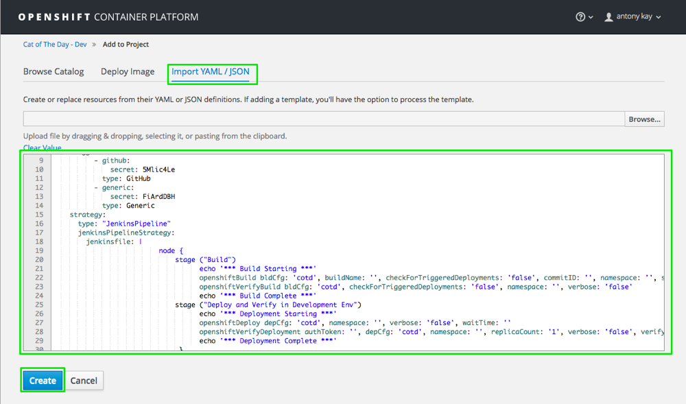

# Cotd CI/CD Demonstration

This include intructions to setup the cotd CICD demonstration.

## Setup

### Create Projects
```
oc new-project pipeline-dev --description="Cat of the Day Development Environment" --display-name="Cat Of The Day - Dev"
oc new-project pipeline-test --description="Cat of the Day Test Environment" --display-name="Cat Of The Day - Test"
oc new-project pipeline-prod --description="Cat of the Day Production Environment" --display-name="Cat Of The Day - Prod"
```

### Install Jenkins
```
oc new-app jenkins-ephemeral -n pipeline-dev
```
The Jenkins login and password is admin:password


### Enable Jenkins SA manage resources from project Test and Prod
```
oc policy add-role-to-user edit system:serviceaccount:pipeline-dev:jenkins -n pipeline-test
oc policy add-role-to-user edit system:serviceaccount:pipeline-dev:jenkins -n pipeline-prod
```
OR
```
oc policy add-role-to-user edit -z jenkins -n pipeline-test
oc policy add-role-to-user edit -z jenkins -n pipeline-prod
```

### Enable the pulling of images from Project Dev to Projects Test and Prod
```
oc policy add-role-to-group system:image-puller system:serviceaccounts:pipeline-test -n pipeline-dev
oc policy add-role-to-group system:image-puller system:serviceaccounts:pipeline-prod -n pipeline-dev
```
OR
```
oc policy add-role-to-group system:image-puller  pipeline-test -n pipeline-dev
oc policy add-role-to-group system:image-puller  pipeline-prod -n pipeline-dev
```

### Deploy the COTD Application 

1. Deploy in Development:
```
oc new-app https://github.com/azipory/cotd.git -n pipleline-dev
```
2. Prepare images for Test and Production:
```
oc tag cotd:latest cotd:testready -n pipeline-dev
oc tag cotd:testready cotd:prodready -n pipeline-dev
```
Check images have been taged:
```
# oc get is
NAME      DOCKER REPO                             TAGS                         UPDATED
cotd      172.30.179.232:5000/pipeline-dev/cotd   prodready,testready,latest   35 minutes ago
```
3. Deploy cotd app in Test and Production:
```
oc new-app pipeline-dev/cotd:testready --name=cotd -n pipeline-test
oc new-app pipeline-dev/cotd:prodready --name=cotd -n pipeline-prod
```
4. Create routes:
```
oc expose service cotd -n pipeline-dev
oc expose service cotd -n pipeline-test
oc expose service cotd -n pipeline-prod
```
5. Disable automatic deployment:
```
oc get dc cotd -o yaml -n pipeline-dev | sed 's/automatic: true/automatic: false/g' | oc replace -f -
oc get dc cotd -o yaml -n pipeline-test| sed 's/automatic: true/automatic: false/g' | oc replace -f -
oc get dc cotd -o yaml -n pipeline-prod | sed 's/automatic: true/automatic: false/g' | oc replace -f -
```
### Import Build Config for Jenkins

#### Use the OpenShift web console :
a. Log in to your OpenShift web console.
b. Select your dev project and click Add to Project.
c. Select the Import YAML/JSON tab, paste the Build Config pipeline text, from cotd.yaml file,  in the text box and click Create:




End with an example of getting some data out of the system or using it for a little demo

## Running the tests

Explain how to run the automated tests for this system

### Break down into end to end tests

Explain what these tests test and why

```
Give an example
```

### And coding style tests

Explain what these tests test and why

```
Give an example
```

## Deployment

Add additional notes about how to deploy this on a live system

## Built With

* [Dropwizard](http://www.dropwizard.io/1.0.2/docs/) - The web framework used
* [Maven](https://maven.apache.org/) - Dependency Management
* [ROME](https://rometools.github.io/rome/) - Used to generate RSS Feeds

## Contributing

Please read [CONTRIBUTING.md](https://gist.github.com/PurpleBooth/b24679402957c63ec426) for details on our code of conduct, and the process for submitting pull requests to us.

## Versioning

We use [SemVer](http://semver.org/) for versioning. For the versions available, see the [tags on this repository](https://github.com/your/project/tags). 

## Authors

* **Billie Thompson** - *Initial work* - [PurpleBooth](https://github.com/PurpleBooth)

See also the list of [contributors](https://github.com/your/project/contributors) who participated in this project.

## License

This project is licensed under the MIT License - see the [LICENSE.md](LICENSE.md) file for details

## Acknowledgments

* Hat tip to anyone who's code was used
* Inspiration
* etc
